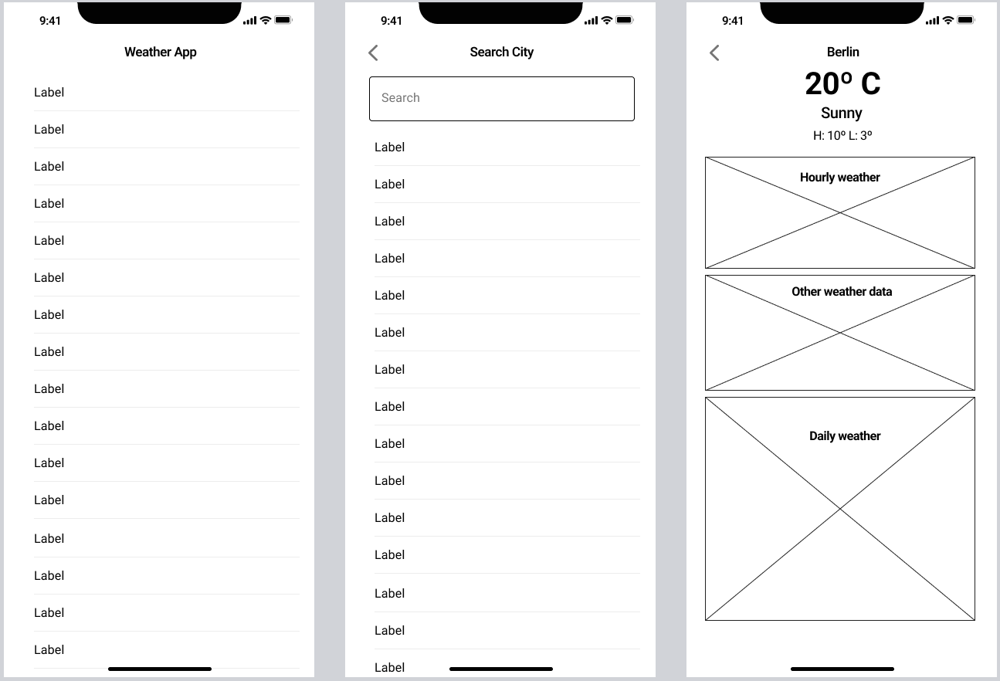

# 🌤️ Weather App (Flutter 3.29.0 + Bloc + Dio + ObjectBox)

A simple **Flutter weather app** that fetches real-time weather data using the **OpenWeatherMap API**. Built with **Bloc**, **Dio**, and **ObjectBox** for state management, networking, and local storage.

---

## 📌 Features

✅ **Search for weather by city**  
✅ **Displays current weather details** (temperature, humidity, wind speed, pressure)  
✅ **Pull-to-refresh support**  
✅ **Error handling with retry option**  
✅ **Dark mode support**  
✅ **Temperature unit toggle (C/F)**  
✅ **Offline support using ObjectBox**  
✅ **Adaptive UI for both portrait & landscape modes**

---

## 🚀 Tech Stack

- **Flutter 3.29.0**
- **State Management:** Bloc (`flutter_bloc`)
- **Networking:** Dio
- **Local Storage:** ObjectBox
- **Environment Configs:** flutter_dotenv
- **Internationalization:** intl

---

## 🔧 Setup & Installation

### **1️⃣ Clone the repository**

```sh
git clone https://github.com/migueloli/weather_app.git
cd weather_app
```

### **2️⃣ Install dependencies**

```sh
flutter pub get
```

### **3️⃣ Set up environment variables**

Create a `.env` file in the root directory and add:

```
API_BASE_URL=https://api.openweathermap.org/data/2.5/
API_KEY=your_actual_api_key
```

### **4️⃣ Build project**

```sh
dart run build_runner build --delete-conflicting-outputs
```

### **5️⃣ Run the app**

```sh
flutter run
```

## 📸 Images


